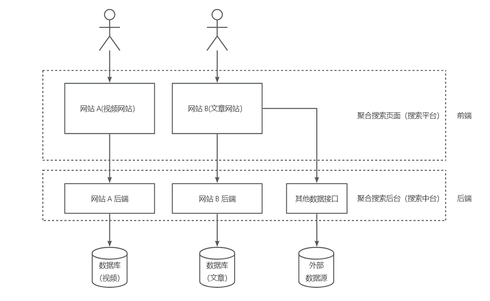

## 项目介绍
基于Vue3 + Spring Boot + Elastic Stack 的一站式聚合搜索平台，用户可以在同一页面集中搜索不同来源、不同内容的数据，提升用户的 检索效率和搜索体验。
  
>线上地址：http://iamshaonian.top:8101/
> 
> 后端项目地址：https://github.com/shaonianjzh/search-backend  
> 
> 前端项目地址：https://github.com/shaonianjzh/search-frontend

## 项目架构

## 技术栈
### 前端

- Vue3
- Ant Design Vue
- Lodash
### 后端  

- Spring Boot
- MySQL
- Elasticsearch 搜索引擎
- 数据抓取
  -  离线
  - 实时
    
- 数据同步（4中同步方式）
    - 定时
    - 双写
    - Logstash
    - Canal
    
- JMeter压力测试
- Guava Retrying   

项目正在完善中ing

最后感谢 [鱼皮](https://github.com/liyupi) 大佬的分享。